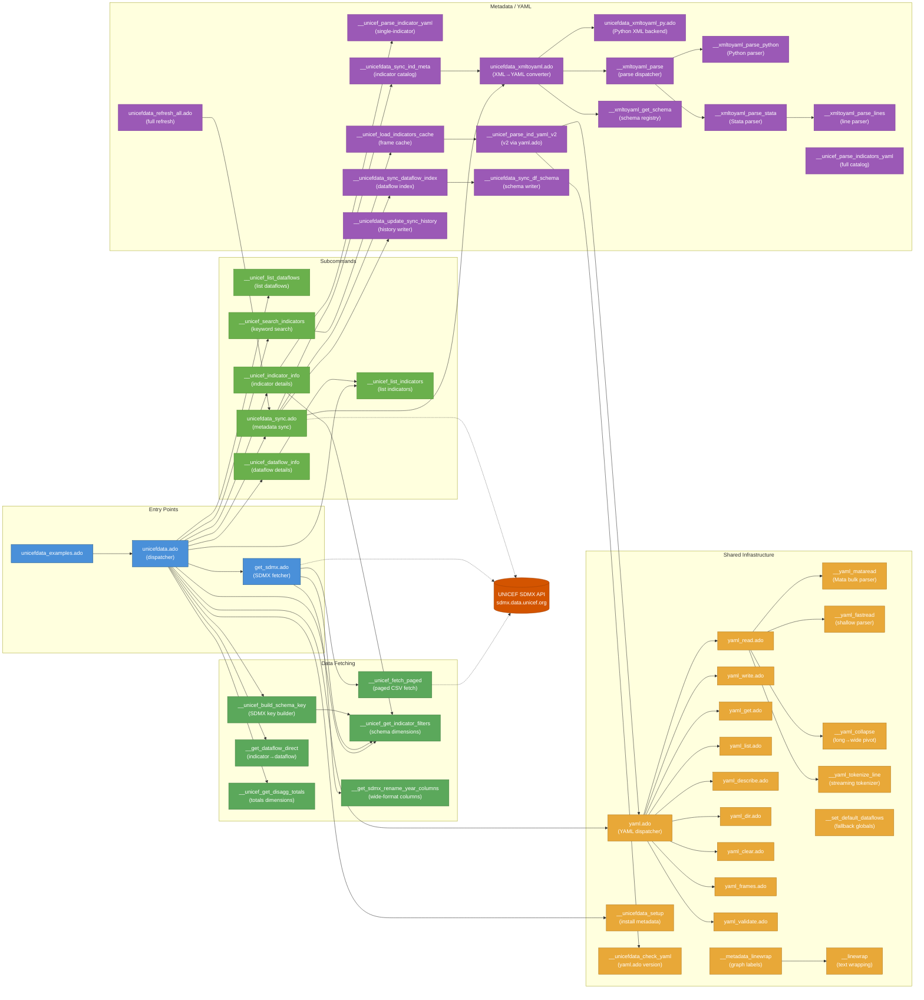
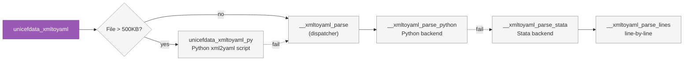
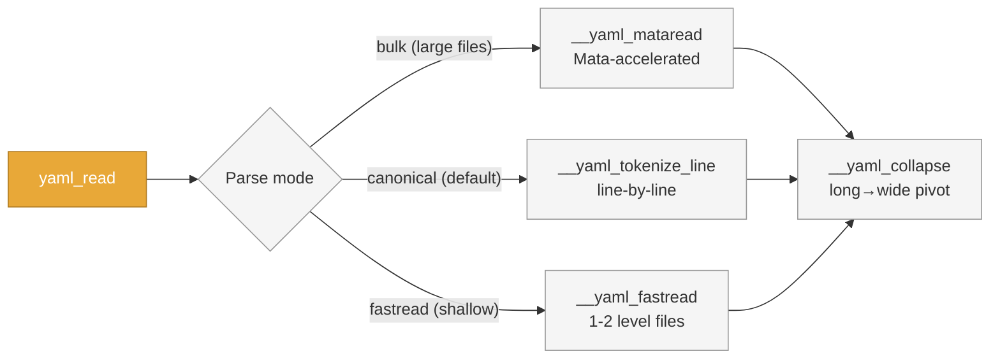
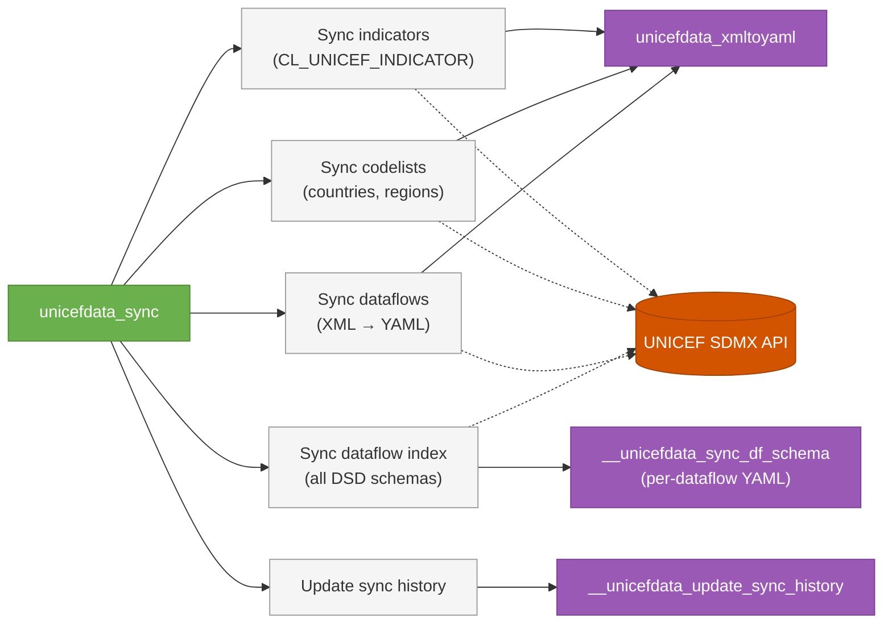
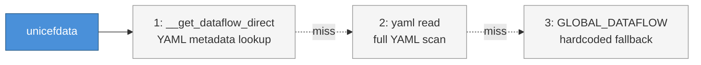

# unicefData Stata Package — Module Architecture

## Module Dependency Diagram



### XML→YAML Parser Selection (`unicefdata_xmltoyaml.ado`)



### YAML Read Paths (`yaml_read.ado`)



### Metadata Sync Pipeline (`unicefdata_sync.ado`)



### Dataflow Resolution (`unicefdata.ado`)



## Module Summary

| Module                                 | Role                              | Layer          | Calls                                                                                                                                                                                                                                                                                                                       |
| -------------------------------------- | --------------------------------- | -------------- | --------------------------------------------------------------------------------------------------------------------------------------------------------------------------------------------------------------------------------------------------------------------------------------------------------------------------- |
| `unicefdata.ado`                       | Main entry point & dispatcher     | Entry          | `get_sdmx`, `__unicef_list_dataflows`, `__unicef_search_indicators`, `__unicef_list_indicators`, `__unicef_indicator_info`, `__unicef_dataflow_info`, `unicefdata_sync`, `__get_dataflow_direct`, `__unicef_get_disagg_totals`, `__unicef_build_schema_key`, `__unicef_get_indicator_filters`, `__unicefdata_setup`, `yaml` |
| `get_sdmx.ado`                         | Low-level SDMX data fetcher       | Entry          | `__unicef_fetch_paged`, `__unicef_get_indicator_filters`, `__get_sdmx_rename_year_columns`                                                                                                                                                                                                                                  |
| `unicefdata_examples.ado`              | Interactive examples (12)         | Entry          | `unicefdata`                                                                                                                                                                                                                                                                                                                |
| `unicefdata_sync.ado`                  | Metadata sync orchestrator        | Subcommand     | `unicefdata_xmltoyaml`, `__unicefdata_sync_dataflow_index`, `__unicefdata_sync_ind_meta`, `__unicefdata_update_sync_history`                                                                                                                                                                                                |
| `unicefdata_refresh_all.ado`           | Full refresh orchestrator         | Subcommand     | `unicefdata_sync`, Python scripts                                                                                                                                                                                                                                                                                           |
| `__unicef_list_dataflows.ado`          | List available dataflows          | Subcommand     | (leaf)                                                                                                                                                                                                                                                                                                                      |
| `__unicef_list_indicators.ado`         | List indicators for a dataflow    | Subcommand     | (leaf)                                                                                                                                                                                                                                                                                                                      |
| `__unicef_search_indicators.ado`       | Keyword search over indicators    | Subcommand     | `__unicef_load_indicators_cache`                                                                                                                                                                                                                                                                                            |
| `__unicef_indicator_info.ado`          | Display indicator metadata        | Subcommand     | `__unicef_parse_indicator_yaml`, `__unicef_get_indicator_filters`                                                                                                                                                                                                                                                           |
| `__unicef_dataflow_info.ado`           | Display dataflow schema details   | Subcommand     | `__unicef_list_indicators`                                                                                                                                                                                                                                                                                                  |
| `get_sdmx.ado`                         | SDMX REST API client              | Fetch          | `__unicef_fetch_paged`, `__unicef_get_indicator_filters`, `__get_sdmx_rename_year_columns`                                                                                                                                                                                                                                  |
| `__unicef_fetch_paged.ado`             | Paged CSV download from API       | Fetch          | (leaf — calls API directly)                                                                                                                                                                                                                                                                                                 |
| `__unicef_build_schema_key.ado`        | Build SDMX filter key             | Fetch          | `__unicef_get_indicator_filters`                                                                                                                                                                                                                                                                                            |
| `__unicef_get_indicator_filters.ado`   | Read schema dimensions from YAML  | Fetch          | (leaf)                                                                                                                                                                                                                                                                                                                      |
| `__get_dataflow_direct.ado`            | Indicator → dataflow YAML lookup  | Fetch          | (leaf)                                                                                                                                                                                                                                                                                                                      |
| `__unicef_get_disagg_totals.ado`       | Get dimensions with \_T totals    | Fetch          | (leaf)                                                                                                                                                                                                                                                                                                                      |
| `__get_sdmx_rename_year_columns.ado`   | Rename year columns (wide format) | Fetch          | (leaf)                                                                                                                                                                                                                                                                                                                      |
| `unicefdata_xmltoyaml.ado`             | XML→YAML converter (dispatcher)   | Metadata       | `__xmltoyaml_get_schema`, `unicefdata_xmltoyaml_py`, `__xmltoyaml_parse`                                                                                                                                                                                                                                                    |
| `unicefdata_xmltoyaml_py.ado`          | Python XML backend                | Metadata       | Python script `unicefdata_xml2yaml.py`                                                                                                                                                                                                                                                                                      |
| `__xmltoyaml_parse.ado`                | Parse dispatcher (Python→Stata)   | Metadata       | `__xmltoyaml_parse_python`, `__xmltoyaml_parse_stata`                                                                                                                                                                                                                                                                       |
| `__xmltoyaml_parse_stata.ado`          | Stata XML parser                  | Metadata       | `__xmltoyaml_parse_lines`                                                                                                                                                                                                                                                                                                   |
| `__xmltoyaml_parse_lines.ado`          | Line-by-line XML element parser   | Metadata       | (leaf)                                                                                                                                                                                                                                                                                                                      |
| `__xmltoyaml_parse_python.ado`         | Python XML parser wrapper         | Metadata       | Python script `unicefdata_xml2yaml.py`                                                                                                                                                                                                                                                                                      |
| `__xmltoyaml_get_schema.ado`           | SDMX type schema registry         | Metadata       | (leaf)                                                                                                                                                                                                                                                                                                                      |
| `__unicef_parse_indicator_yaml.ado`    | Single-indicator YAML parser      | Metadata       | (leaf)                                                                                                                                                                                                                                                                                                                      |
| `__unicef_parse_indicators_yaml.ado`   | Full catalog YAML parser (v1)     | Metadata       | (leaf)                                                                                                                                                                                                                                                                                                                      |
| `__unicef_parse_ind_yaml_v2.ado`       | Full catalog YAML parser (v2)     | Metadata       | `__unicefdata_check_yaml`, `yaml`                                                                                                                                                                                                                                                                                           |
| `__unicef_load_indicators_cache.ado`   | Frame-cached indicator loader     | Metadata       | `__unicef_parse_ind_yaml_v2`                                                                                                                                                                                                                                                                                                |
| `__unicefdata_sync_dataflow_index.ado` | Sync all dataflow schemas         | Metadata       | `__unicefdata_sync_df_schema`                                                                                                                                                                                                                                                                                               |
| `__unicefdata_sync_df_schema.ado`      | Write single dataflow schema YAML | Metadata       | (leaf)                                                                                                                                                                                                                                                                                                                      |
| `__unicefdata_sync_ind_meta.ado`       | Sync indicator catalog            | Metadata       | `unicefdata_xmltoyaml`                                                                                                                                                                                                                                                                                                      |
| `__unicefdata_update_sync_history.ado` | Write sync history YAML           | Metadata       | (leaf)                                                                                                                                                                                                                                                                                                                      |
| `yaml.ado`                             | YAML subcommand dispatcher        | Infrastructure | `yaml_read`, `yaml_write`, `yaml_get`, `yaml_list`, `yaml_describe`, `yaml_dir`, `yaml_clear`, `yaml_frames`, `yaml_validate`                                                                                                                                                                                               |
| `yaml_read.ado`                        | YAML file reader (3 parse paths)  | Infrastructure | `__yaml_mataread`, `__yaml_fastread`, `__yaml_collapse`, `__yaml_tokenize_line`                                                                                                                                                                                                                                             |
| `yaml_write.ado`                       | YAML file writer                  | Infrastructure | (leaf)                                                                                                                                                                                                                                                                                                                      |
| `yaml_get.ado`                         | Retrieve YAML key values          | Infrastructure | (leaf)                                                                                                                                                                                                                                                                                                                      |
| `yaml_list.ado`                        | List YAML keys/values             | Infrastructure | (leaf)                                                                                                                                                                                                                                                                                                                      |
| `yaml_describe.ado`                    | Show YAML structure               | Infrastructure | (leaf)                                                                                                                                                                                                                                                                                                                      |
| `yaml_dir.ado`                         | List YAML data in memory          | Infrastructure | (leaf)                                                                                                                                                                                                                                                                                                                      |
| `yaml_clear.ado`                       | Clear YAML data from memory       | Infrastructure | (leaf)                                                                                                                                                                                                                                                                                                                      |
| `yaml_frames.ado`                      | List YAML frames                  | Infrastructure | (leaf)                                                                                                                                                                                                                                                                                                                      |
| `yaml_validate.ado`                    | Validate YAML against schema      | Infrastructure | (leaf)                                                                                                                                                                                                                                                                                                                      |
| `__yaml_mataread.ado`                  | Mata-accelerated bulk parser      | Infrastructure | (leaf)                                                                                                                                                                                                                                                                                                                      |
| `__yaml_fastread.ado`                  | Shallow YAML fast parser          | Infrastructure | (leaf)                                                                                                                                                                                                                                                                                                                      |
| `__yaml_collapse.ado`                  | Long→wide YAML pivot              | Infrastructure | (leaf)                                                                                                                                                                                                                                                                                                                      |
| `__yaml_tokenize_line.ado`             | YAML line tokenizer               | Infrastructure | (leaf)                                                                                                                                                                                                                                                                                                                      |
| `__unicefdata_setup.ado`               | First-run metadata installer      | Infrastructure | (leaf)                                                                                                                                                                                                                                                                                                                      |
| `__unicefdata_check_yaml.ado`          | Check/install yaml.ado version    | Infrastructure | (leaf)                                                                                                                                                                                                                                                                                                                      |
| `__set_default_dataflows.ado`          | Hardcoded fallback dataflows      | Infrastructure | (leaf)                                                                                                                                                                                                                                                                                                                      |
| `__linewrap.ado`                       | Text line wrapping                | Infrastructure | (leaf)                                                                                                                                                                                                                                                                                                                      |
| `__metadata_linewrap.ado`              | Graph-label line wrapping         | Infrastructure | `__linewrap`                                                                                                                                                                                                                                                                                                                |

## Call Flow Example

```
User: unicefdata, indicator(MNCH_SAB) country(BRA;IND) year(2010/2020)

  unicefdata.ado
    ├─ __unicefdata_setup             (ensure YAML metadata installed)
    ├─ parse subcommand → data retrieval mode
    ├─ __get_dataflow_direct          (look up MNCH_SAB → MNCH dataflow)
    │    └─ reads _unicefdata_indicators_metadata.yaml
    ├─ __unicef_get_disagg_totals     (SEX has _T → auto-filter SEX=_T)
    ├─ __unicef_get_indicator_filters (read MNCH schema dimensions)
    ├─ __unicef_build_schema_key      (build key: MNCH.MNCH_SAB.BRA+IND._T...)
    │    └─ __unicef_get_indicator_filters
    └─ get_sdmx                       (fetch data from SDMX API)
         ├─ __unicef_get_indicator_filters (validate dimensions)
         ├─ build URL: sdmx.data.unicef.org/ws/public/sdmxapi/rest/data/MNCH/...
         ├─ __unicef_fetch_paged      (page 1: import CSV)
         │    └─ HTTP GET → API (100K rows/page)
         ├─ page 2... (if needed)
         └─ return to unicefdata.ado
    unicefdata.ado
    ├─ label variables, apply value labels
    ├─ store char _dta[unicef_*] metadata
    └─ return r(N), r(indicator), r(dataflow)
```
